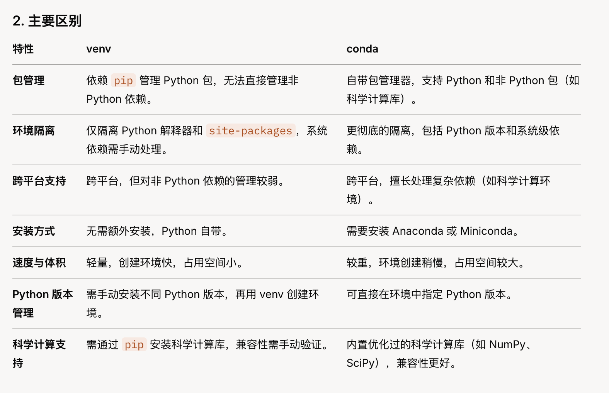

选择 venv 的场景:
项目简单，仅需隔离 Python 包。
不想安装额外工具，追求轻量。
开发 Web 应用、脚本等非科学计算项目。
选择 conda 的场景:
数据科学、机器学习、科学计算项目，需要管理复杂依赖（如 TensorFlow、PyTorch）。
需要跨 Python 版本或管理非 Python 库（如 MKL、CUDA）。
希望更省心的依赖解析和兼容性保证。

ps:
混合使用：可以在 conda 环境中使用 pip，但需小心包冲突。建议优先用 conda install，仅在 conda 源缺失时用 pip。
性能：venv 创建的环境更轻量，适合快速迭代；conda 环境更适合长期、复杂项目。
社区与生态：venv 是官方工具，社区支持广泛；conda 在数据科学领域有强大生态。